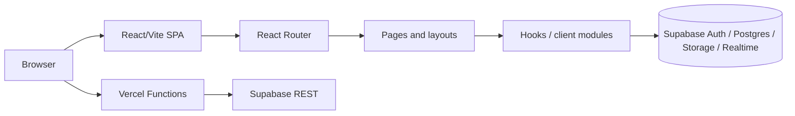

# Current Architecture

Статус документа: **CONFIRMED** — описание основано на коде ветки `feature/next-ssr` на 2026-08-10.

SPORTO — React 18 SPA на TypeScript и Vite. Браузер монтирует приложение из `src/main.tsx`, providers определены в `src/app/App.tsx`, маршрутизация работает через React Router в `src/app/routes.tsx`. Клиент напрямую обращается к Supabase через `@supabase/supabase-js`; отдельные SEO и submission-сценарии обслуживают Vercel Functions из `api/`.

Подтверждённый основной stack из `package.json`: React `18.3.1`, React DOM `18.3.1`, TypeScript `5.8.3`, Vite `6.3.5`, Next.js `16.2.4`, React Router `7.13.0`, Supabase JS `^2.98.0`, React Helmet Async `^3.0.0`, Tailwind CSS `4.1.12`, EmailJS Browser `^4.4.1`. Vercel Analytics удалён 2026-08-27. Runtime requirement: Node.js `>=18.0.0`.

## Project structure

| Path | Назначение |
|---|---|
| `src/main.tsx` | `ReactDOM.createRoot`, `HelmetProvider` для legacy Vite SPA |
| `src/app/App.tsx` | `AuthProvider`, `LanguageProvider`, `CartProvider`, `CategoriesProvider`, `RouterProvider` |
| `src/app/routes.tsx` | Все React Router routes |
| `src/app/Layout.tsx` | Публичный layout |
| `src/app/AdminLayout.tsx` | Layout и навигация admin UI; текущая session-проверка |
| `src/app/pages/` | Публичные и admin страницы |
| `src/app/hooks/` | Публичная загрузка данных, content/settings, Realtime notifications |
| `src/app/contexts/` | Auth, language, cart и categories state |
| `src/lib/supabase.ts` | Единственный явно созданный Supabase client и общие row types |
| `src/lib/` | Auth helper, clients, email, search, order submission и cache |
| `src/database/` | SQL schema/migrations, RLS policies и RPC functions |
| `api/` | Vercel serverless functions |
| `public/robots.txt` | Текущий robots policy |
| `vercel.json` | Bot/SPA rewrites, cache и security headers |

## Routing

Источник: `src/app/routes.tsx`.

### Public routes

| Route | Component |
|---|---|
| `/` | `Home` |
| `/ru` | `Home` |
| `/catalog` | `Catalog` |
| `/product/:slug/:sku` | `ProductDetail` |
| `/product/:id` | `ProductDetail` |
| `/brands/:brandId` | `BrandPage` |
| `/login` | `Login` |
| `/forgot-password` | `ForgotPassword` |
| `/reset-password` | `ResetPassword` |
| `/verify` | `EmailVerify` |
| `/account` | `Account` |
| `/turnkey-solutions` | `TurnkeySolutions` |
| `/maintenance-service` | `MaintenanceService` |
| `/order-request` | `OrderRequest` |
| `/contacts` | `Contacts` |
| `/about` | `About` |
| `/terms-of-cooperation` | `TermsOfCooperation` |
| `/delivery-terms` | `DeliveryTerms` |
| `/privacy-policy` | `PrivacyPolicy` |
| `*` | `NotFound` |

`src/app/pages/Register.tsx` существует и использует canonical `/register`, но route `/register` в `src/app/routes.tsx` отсутствует. Это расхождение **CONFIRMED**.

### Admin routes

| Route | Component |
|---|---|
| `/admin/login` | `AdminLogin` |
| `/admin` | `AdminHub` внутри `AdminLayout` |
| `/admin/products` | `AdminProducts` |
| `/admin/brands` | `AdminBrands` |
| `/admin/categories` | `AdminCategories` |
| `/admin/attributes` | `AdminAttributes` |
| `/admin/featured` | `AdminFeatured` |
| `/admin/import` | `AdminImport` |
| `/admin/banners` | `AdminBanners` |
| `/admin/clients` | `AdminClients` |
| `/admin/requests` | `AdminRequests` |
| `/admin/contacts` | `AdminContacts` |
| `/admin/popup` | `AdminPopup` |
| `/admin/faq` | `AdminFaq` |
| `/admin/services` | `AdminServices` |
| `/admin/maintenance` | `AdminMaintenance` |
| `/admin/content-pages` | `AdminContentPages` |

## Data layer

### Public hooks and modules

| Module | Confirmed data access |
|---|---|
| `src/app/hooks/useSupabaseProducts.ts` | `products`, RPC `search_products_catalog`, paging/filter/search; retry and in-memory cache |
| `src/app/hooks/useSupabaseBrands.ts` | `brands`, active product brand values и counts |
| `src/app/hooks/useSupabaseBanners.ts` | Active `banners` |
| `src/app/contexts/CategoriesContext.tsx` | `categories`, `subcategories`, Realtime refresh |
| `src/app/hooks/useProductAttributes.ts` | `product_attributes`, `product_attribute_values` |
| `src/app/hooks/useContacts.ts` | `site_settings` read/upsert |
| `src/app/hooks/usePageContent.ts` | `page_content` read/upsert |
| `src/app/lib/popup-config.ts` | Popup config in `page_content`, Realtime subscription |
| `src/lib/clients.ts` | Find/insert/update `clients` |
| `src/lib/orderRequests.ts` | `POST /api/order-request` |
| `src/app/pages/BrandPage.tsx` | Direct `brands` query |
| `src/app/pages/About.tsx` | Direct `faq_items` query |
| `src/app/pages/Contacts.tsx` | Insert into `contact_requests` |
| `src/app/components/ConsultationModal.tsx` | Insert into `consultation_requests` |
| `src/app/components/PriceListModal.tsx` | Insert into `pricelist_requests` |

`src/lib/queryCache.ts` хранит cache в памяти JavaScript, а не в Web Storage.

### Admin CRUD

CRUD не централизован: он расположен непосредственно в `src/app/pages/AdminProducts.tsx`, `AdminCategories.tsx`, `AdminBrands.tsx`, `AdminBanners.tsx`, `AdminAttributes.tsx`, `AdminFeatured.tsx`, `AdminImport.tsx`, `AdminClients.tsx`, `AdminRequests.tsx`, `AdminFaq.tsx`, `AdminContacts.tsx`, `AdminServices.tsx`, `AdminMaintenance.tsx`, `AdminContentPages.tsx` и `AdminHub.tsx`.

## Supabase

### Client

`src/lib/supabase.ts` создаёт один browser client через `createClient(SUPABASE_URL, SUPABASE_ANON_KEY)`. Явные `persistSession`/cookie options отсутствуют, поэтому используется стандартное browser persistence Supabase JS.

### Auth

Используются `getSession`, `getUser`, `onAuthStateChange`, `signInWithPassword`, `signUp`, `signOut`, `resetPasswordForEmail` и `updateUser` в `src/app/contexts/AuthContext.tsx`, `src/lib/adminAuth.ts`, `src/app/AdminLayout.tsx`, `Account.tsx`, `ForgotPassword.tsx` и `ResetPassword.tsx`.

### Database

Подтверждённые таблицы, к которым обращается TypeScript-код: `products`, `brands`, `banners`, `categories`, `subcategories`, `product_attributes`, `product_attribute_values`, `page_content`, `site_settings`, `faq_items`, `clients`, `order_requests`, `contact_requests`, `consultation_requests`, `pricelist_requests`.

### Storage

| Bucket | Usage | Files |
|---|---|---|
| `product-images` | Product, banner и service uploads/public URLs | `AdminProducts.tsx`, `AdminBanners.tsx`, `AdminServices.tsx` |
| `brand-logos` | Brand logo uploads/public URLs | `AdminBrands.tsx` |
| `brand-banners` | Brand banner uploads/public URLs | `AdminBrands.tsx` |

### Realtime

Confirmed channels: `categories-realtime`, `site-popup-config`, `admin-order-inserts`, `admin-banners-rt`, `admin-clients-realtime`, `admin-products-realtime`, `admin-requests-realtime`. См. `CategoriesContext.tsx`, `popup-config.ts`, `useAdminNotifications.ts` и соответствующие admin pages.

### RPC

| RPC | Caller | Purpose |
|---|---|---|
| `search_products_catalog` | `src/app/hooks/useSupabaseProducts.ts` | Catalog search/filter result |
| `consume_order_request_rate_limit` | `api/order-request.ts` | Server-side rate limit |
| `link_order_request_client` | `api/order-request.ts` | Link accepted order to client |

Последние две функции определены и разрешены только `service_role` в `src/database/add_secure_order_request_submission.sql`.

### RLS files

- `src/database/schema.sql`: RLS для `products`, включая public active reads, full access для `authenticated` и full access для `anon`.
- `src/database/add_dynamic_product_attributes.sql`: public reads и full management для `authenticated` и `anon` для attributes/value tables.
- `src/database/add_secure_order_request_submission.sql`: RLS для `clients`, `order_requests`, rate-limit table; admin email policies; own-profile rules; restricted RPC grants.
- Остальные `src/database/*.sql` добавляют product/brand fields и unique client email.

Наличие SQL в репозитории не доказывает, что deployed Supabase применил каждый файл. Состояние deployed policies — **REVIEW**.

## Authentication

### Regular user

1. `AuthProvider` в `src/app/contexts/AuthContext.tsx` вызывает `supabase.auth.getSession()` при mount.
2. Если session email не совпадает с configured admin email, профиль ищется в `clients` по email.
3. `onAuthStateChange` синхронизирует React state.
4. Login использует `signInWithPassword`; registration — `signUp` с `emailRedirectTo` на `/account`.
5. Если signup сразу создаёт session, `ensureClientRecord` сохраняет `clients` row (`src/lib/clients.ts`). SQL также содержит trigger `handle_new_sporto_auth_user` (`src/database/add_secure_order_request_submission.sql`).
6. Reset flow использует `/forgot-password`, `/reset-password`, `resetPasswordForEmail` и `updateUser`.

### Administrator

`src/lib/adminAuth.ts` допускает login только для email из `VITE_ADMIN_LOGIN_EMAIL`/`VITE_ADMIN_EMAIL`, вызывает Supabase password login и устанавливает `localStorage.sporto_admin_ok`. `isAdminLoggedIn` требует flag, live session и matching email.

Однако `src/app/components/AdminGuard.tsx` нигде не используется. Реальный `src/app/AdminLayout.tsx` проверяет только наличие `data.session` и принимает любую authenticated session. Поэтому route-level admin UI guard слабее helper-проверки — **CONFIRMED security issue**. Доступ к данным дополнительно зависит от deployed RLS.

## Browser state

| Key | Storage | File | Purpose | SSR impact |
|---|---|---|---|---|
| `cart` | localStorage | `src/app/contexts/CartContext.tsx` | Cart persistence | Нельзя читать во время SSR без client boundary |
| `language` | localStorage | `src/app/contexts/LanguageContext.tsx` | Selected `ro`/`ru` language | Конфликтует с URL-first SSR locale model |
| `admin-ui-lang` | localStorage | `src/app/contexts/AdminLangContext.tsx` | Admin UI language | Client-only initialization |
| `sporto_admin_ok` | localStorage | `src/lib/adminAuth.ts`, `AuthContext.tsx` | Distinguishes admin login | Непригоден для server authorization |
| `sporto_search_history` | localStorage | `src/lib/searchEngine.ts` | Recent searches | Client-only feature |
| `sporto_cookie_consent` | localStorage | `src/app/components/CookieBanner.tsx` | Consent state | Нужна SSR-safe initialization/client boundary |
| `sporto_admin_request_comments` | localStorage | `src/app/pages/AdminRequests.tsx` | Draft admin comments | Client-only admin feature |
| `sporto_promo_seen` | sessionStorage | `src/app/components/PromoPopup.tsx`, `AdminPopup.tsx` | Show-once popup per tab | Client-only feature |
| Supabase auth key (`sb-…-auth-token`) | localStorage by library default | `src/lib/supabase.ts` | Auth session persistence | Должен быть заменён cookie flow для SSR |

## Browser APIs

| API | Files | Purpose | SSR impact |
|---|---|---|---|
| `document.getElementById` | `src/main.tsx`, `BrandPage.tsx` | Mount/scroll target | Browser only |
| `document.body.style` | `Header.tsx`, modal/gallery components, `AdminCategories.tsx` | Scroll locking | Client component/effect |
| document events/activeElement | `AdminLayout.tsx`, `AdminProducts.tsx`, `Catalog.tsx`, `PhoneInput.tsx`, notifications | Outside click/input/audio unlock | Client only |
| `window.location` | `LanguageContext.tsx`, email/contact/modal modules, `ProductDetail.tsx` | URL/origin/query | Request URL or client boundary needed |
| History API / `popstate` | `LanguageContext.tsx` | Locale URL synchronization | Replaced by App Router navigation |
| `window.innerWidth`, resize | `ProductDetail.tsx`, `AdminCategories.tsx`, `use-mobile.ts` | Responsive behavior | Client only; initial server markup must be stable |
| `matchMedia` | `src/app/components/ui/use-mobile.ts` | Mobile breakpoint | Client only |
| keyboard/timer/scroll APIs | Search, gallery, modal, catalog, marquee, sidebar | Interaction | Client only |
| `URL.createObjectURL`, dynamic anchors | Admin products/import/clients/hub | File export/download | Client only |
| `window.open`, `window.confirm` | Admin pages | Mail and confirmation actions | Client only |
| Notification API / Audio | `src/app/hooks/useAdminNotifications.ts` | New order alerts | Client only, permission/user gesture required |
| Web Speech API | `src/app/components/SearchDropdown.tsx`, types in `src/vite-env.d.ts` | Voice search | Client only, browser support dependent |
| `window.gtag` | `src/lib/googleAds.ts` | Google Ads conversion | Client only |
| `document.cookie` | `src/app/components/ui/sidebar.tsx` | Sidebar state | Browser mutation; unrelated to current Auth flow |

Browser-oriented dependencies include `@emailjs/browser`, `react-helmet-async`, `react-window`, `react-dnd-html5-backend` and UI components that use DOM events. Their exact Next boundary remains **REVIEW** per component. `@vercel/analytics` уже удалён.

## Fetch and external calls

- `src/lib/orderRequests.ts` calls `POST /api/order-request`.
- `src/app/pages/AdminProducts.tsx` fetches product images for Excel export.
- `api/product-meta.ts`, `api/seo-page.ts`, `api/sitemap.ts` fetch Supabase REST with anon key.
- `api/order-request.ts` fetches Supabase REST with `SUPABASE_SERVICE_ROLE_KEY`.
- `src/lib/emailService.ts`, `Contacts.tsx`, `ConsultationModal.tsx`, `PriceListModal.tsx` call EmailJS in the browser.
- `src/lib/googleAds.ts` calls `window.gtag` if present. Vercel Analytics больше не монтируется ни в Vite, ни в Next.

## Vercel

| Function | Purpose | Dependencies | Replacement needed |
|---|---|---|---|
| `api/order-request.ts` | Validate request, honeypot, rate limit, insert order, link client | Supabase REST, service role, Web Crypto | **MIGRATE** to server-only endpoint |
| `api/product-meta.ts` | Bot HTML for product metadata and Product JSON-LD | Supabase REST anon | **REPLACE** with SSR/Metadata API |
| `api/seo-page.ts` | Bot HTML for static/catalog/brand pages | Supabase REST anon | **REPLACE** with SSR/Metadata API |
| `api/site-meta.ts` | Static home metadata HTML | No external data | **REVIEW/REMOVE**; no current `vercel.json` rewrite targets it |
| `api/sitemap.ts` | Dynamic multilingual sitemap | Supabase REST anon | **REPLACE** with Next sitemap route |

`vercel.json` contains:

- `/sitemap.xml` rewrite to `/api/sitemap`;
- User-Agent conditional rewrites for bots/social previews to SEO functions;
- SPA rewrites of public/admin routes to `/index.html`;
- immutable cache header for `/assets/*`;
- global `X-Content-Type-Options`, `X-Frame-Options`, legacy `X-XSS-Protection`, `Referrer-Policy`, `Permissions-Policy`;
- daily cache headers for `robots.txt` and `sitemap.xml`.

Redirects are not configured.

## SEO

Browser SEO is produced by `src/app/components/SeoHead.tsx` through `react-helmet-async`: title, description, robots, Open Graph, Twitter cards, canonical, hreflang and JSON-LD. It is used by public pages and marks auth/admin/404 pages `noIndex`.

Because the application is an SPA, Vercel gives matching crawlers separate HTML from `api/product-meta.ts` or `api/seo-page.ts`. Product function builds Product/Offer JSON-LD; general SEO function builds WebSite/Organization/Breadcrumb/list/brand schemas as applicable. `api/site-meta.ts` duplicates a subset but is not referenced by `vercel.json`.

`api/sitemap.ts` generates static and dynamic product/category/subcategory/brand entries with alternate languages. `public/robots.txt` references `https://www.sporto.md/sitemap.xml`. `scripts/prerender-products.mjs` also contains a product HTML generator, but no `package.json` script invokes it — active use is **REVIEW**.

Current locale URL model is inconsistent: only home has `/ru`; catalog uses `?lang=ru` in canonical generation, while most other page paths have no locale prefix. See `src/app/contexts/LanguageContext.tsx`, `Home.tsx`, `Catalog.tsx`, `ProductDetail.tsx` and `api/seo-page.ts`.

## Environment variables

Значения намеренно не приводятся.

| Variable | Used in | Browser/server | Purpose |
|---|---|---|---|
| `VITE_SUPABASE_URL` | `src/lib/supabase.ts`, serverless functions | Both | Supabase project URL |
| `VITE_SUPABASE_ANON_KEY` | `src/lib/supabase.ts`, SEO/sitemap functions | Both; exposed by design | Supabase anon key |
| `VITE_SITE_URL` | `src/lib/supabase.ts` | Browser | Public site origin |
| `VITE_ADMIN_LOGIN_EMAIL` | `AuthContext.tsx`, `adminAuth.ts` | Browser | Allowed admin email |
| `VITE_ADMIN_EMAIL` | Auth fallback and EmailJS | Browser | Admin identity/notification destination |
| `VITE_EMAILJS_PUBLIC_KEY` | `src/lib/emailService.ts` | Browser | EmailJS public key |
| `VITE_EMAILJS_SERVICE_ID` | `src/lib/emailService.ts` | Browser | EmailJS service |
| `VITE_EMAILJS_TEMPLATE_WELCOME` | `src/lib/emailService.ts` | Browser | Welcome template |
| `VITE_EMAILJS_TEMPLATE_ADMIN` | `src/lib/emailService.ts` | Browser | Admin notification template |
| `SUPABASE_SERVICE_ROLE_KEY` | `api/order-request.ts` | Server only | Privileged order submission/RPC access |

## Security notes

1. **CONFIRMED — admin route guard gap.** `AdminLayout.tsx` accepts any Supabase session; `AdminGuard.tsx` is unused. UI protection and `localStorage` flag are not server authorization.
2. **CONFIRMED — broad policies in repository SQL.** `src/database/schema.sql` grants `anon` full access to `products`; `add_dynamic_product_attributes.sql` grants `anon` full management of attributes. Authenticated product/attribute management is also not restricted to admin. Actual deployed policies require direct verification.
3. **CONFIRMED — admin identity duplicated.** Browser env email is used in code, while `add_secure_order_request_submission.sql` compares JWT email to a hard-coded address. Configuration drift can deny the intended admin or authorize a different account.
4. **CONFIRMED — service-role placement is correct in code.** It appears only in `api/order-request.ts` via `process.env` and is not prefixed `VITE_`. It must remain server-only after migration.
5. **CONFIRMED — public client credentials have source fallbacks.** `src/lib/supabase.ts` and SEO functions contain fallback URL/anon key values. An anon key is client-exposed by design, but its safety depends entirely on RLS.
6. **CONFIRMED — EmailJS calls occur from browser code.** Public EmailJS configuration and templates must be treated as client-visible and abuse controls reviewed.
7. **REVIEW — repository SQL versus production.** The repository cannot confirm which migrations/policies are deployed; audit the live Supabase project before relying on them.
