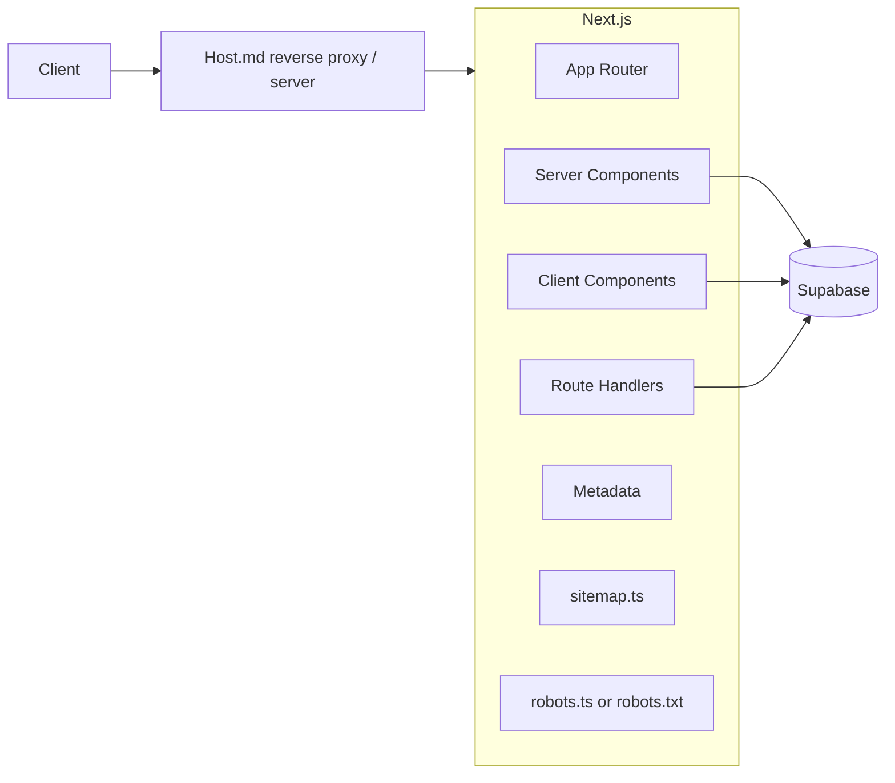

# Target Architecture

Статус: **PLANNED** — целевая модель следует из утверждённого scope и текущего кода SPORTO. Нерешённые детали отмечены **REVIEW**.

## Goals

- Next.js App Router и SSR.
- Self-hosting на Host.md; Vercel полностью выводится после cutover.
- Supabase остаётся Auth/data/Storage/Realtime backend.
- SSR-compatible Supabase Auth через cookies.
- Публичные URL имеют locale segment только для существующих языков `ro` и `ru`.
- Текущий Vercel production работает до полной проверки replacement.
- UI/catalog scope ограничен утверждённым клиентским ТЗ.

## High-level architecture



Reverse proxy/server configuration, process manager and deployment mechanics are **REVIEW**; утверждён только Host.md/self-hosted target.

## Server vs Client boundaries

### Server Component candidates

Это кандидаты, а не окончательная пометка файлов:

- Initial reads для products/catalog/product/brands/banners/categories (`useSupabaseProducts.ts`, `useSupabaseBrands.ts`, `useSupabaseBanners.ts`, `CategoriesContext.tsx`).
- Initial reads для `page_content`, `site_settings`, `faq_items` (`usePageContent.ts`, `useContacts.ts`, `About.tsx`).
- Public page shells and initial HTML: Home, Catalog, ProductDetail, BrandPage, About, Contacts, service/legal pages.
- Server metadata/JSON-LD для страниц, которые сейчас используют `SeoHead.tsx` и Vercel SEO functions.

### Must remain Client Components or client islands

- Cart interactions and chosen SSR-safe persistence (`CartContext.tsx`) — storage choice **REVIEW**.
- Search dropdown/history/voice recognition (`SearchDropdown.tsx`, `searchEngine.ts`).
- Filters, sorting controls, pagination interaction and scroll behavior in `Catalog.tsx`.
- Modals, lightbox, popup, cookie banner, menus and responsive browser listeners.
- Product gallery/video/client carousel behavior.
- Admin forms, drag-and-drop, Excel/CSV download and Realtime subscriptions.
- Notification API/audio and Web Speech API.
- Google Ads `gtag` and browser EmailJS calls — final handling **REVIEW**. Vercel Analytics has been removed without replacement.

### Cannot be finalized before implementation

- Exact split of large mixed pages such as `Catalog.tsx`, `ProductDetail.tsx` and admin pages.
- Cart persistence replacement.
- Whether Realtime remains direct browser-to-Supabase in every current location.
- EmailJS browser calls versus server endpoint.
- Cache/revalidation policy for each Supabase query.

## Authentication target

### Regular user

**PLANNED:** create SSR-compatible Supabase browser/server clients, store session in cookies, refresh it in the request flow, and derive server-rendered auth state from verified Supabase session/user. Preserve login, signup, email verification, password reset and `clients` profile behavior currently in `AuthContext.tsx`.

### Administrator

**PLANNED:** protect admin layouts and server mutations on the server. Remove `sporto_admin_ok` as an authorization mechanism. Admin identity/role must have one server-verifiable source consistent with Supabase RLS. Exact role representation (email policy versus claims/profile role) is **REVIEW** and must not be decided implicitly.

## Multilingual routing

Confirmed languages: `ro`, `ru` (`LanguageContext.tsx`, localized data fields).

Target model:

```text
/ro
/ru
/ro/catalog
/ru/catalog
/ro/product/<slug>/<sku>
/ru/product/<slug>/<sku>
/ro/brands/<brandId>
/ru/brands/<brandId>
/ro/contacts
/ru/contacts
...
```

`[lang]` is the App Router locale segment. Switching language changes the route instead of only localStorage/query state. Canonical and hreflang must use the same model. Whether admin routes receive locale segments is **REVIEW**; current admin has its own `AdminLangContext`.

## Data access

| Current | Target classification | Action |
|---|---|---|
| Public initial reads in data hooks/useEffect | Server-side data modules and Server Components | **MIGRATE** |
| Catalog interactive state | Client island receiving server initial data | **MIGRATE** |
| Browser Supabase Auth session | Cookie-aware browser/server clients | **REPLACE** |
| Admin writes embedded in components | Server-authorized mutations; exact Server Action/Route Handler split **REVIEW** | **MIGRATE** |
| Realtime subscriptions | Client Components only where live updates are required | **KEEP/MIGRATE** |
| `POST /api/order-request` | Server-only Next Route Handler preserving checks | **MIGRATE** |
| EmailJS browser calls | Preserve initially or move server-side after abuse/security review | **REVIEW** |
| Memory cache in `queryCache.ts` | Next cache/revalidation only after per-query decision | **REVIEW** |

## Vercel replacement map

| Current | Target | Action |
|---|---|---|
| React Router (`src/app/routes.tsx`) | App Router filesystem routes | **REPLACE** |
| `src/main.tsx` SPA mount | Next root/layout entry | **REPLACE** |
| `src/app/App.tsx` providers | Server root layout plus minimal client providers | **MIGRATE** |
| `Layout.tsx` | Public locale layout | **MIGRATE** |
| `AdminLayout.tsx` | Server-protected admin layout plus client navigation | **MIGRATE** |
| `api/order-request.ts` | Next server Route Handler | **MIGRATE** |
| `api/product-meta.ts` | Product SSR + Metadata API/JSON-LD | **REPLACE**, then **REMOVE** old function |
| `api/seo-page.ts` | Page SSR + Metadata API/JSON-LD | **REPLACE**, then **REMOVE** old function |
| `api/site-meta.ts` | Next Metadata API; active use first verify | **REVIEW**, likely **REMOVE** |
| `api/sitemap.ts` | Next `sitemap.ts` or equivalent route | **REPLACE** |
| `public/robots.txt` | Self-hosted static file or Next `robots.ts` | **MIGRATE** |
| Bot User-Agent rewrites | Normal SSR response for every client | **REMOVE** after parity |
| SPA `/index.html` rewrites | App Router routing | **REMOVE** after parity |
| Vercel headers | Next/server/reverse-proxy headers | **MIGRATE** |
| `@vercel/analytics/react` | No replacement during migration | **REMOVED** |
| Vercel deployment | Host.md self-hosting | **REPLACE** after testing |
| Supabase backend/Storage/Realtime | Supabase | **KEEP** |
| `scripts/prerender-products.mjs` | SSR product pages | **REVIEW**, then remove only if confirmed unused |

## Target route groups

Conceptual mapping only; exact folder names are implemented in Phase 2/4:

- locale public pages under `app/[lang]/...`;
- auth pages under the locale model where appropriate;
- admin layout/routes separated from public layout;
- server route for order submission;
- metadata, sitemap and robots generated by Next;
- not-found handling through App Router.

No Kubernetes, Redis, Docker, queues or microservices are part of the approved target.
